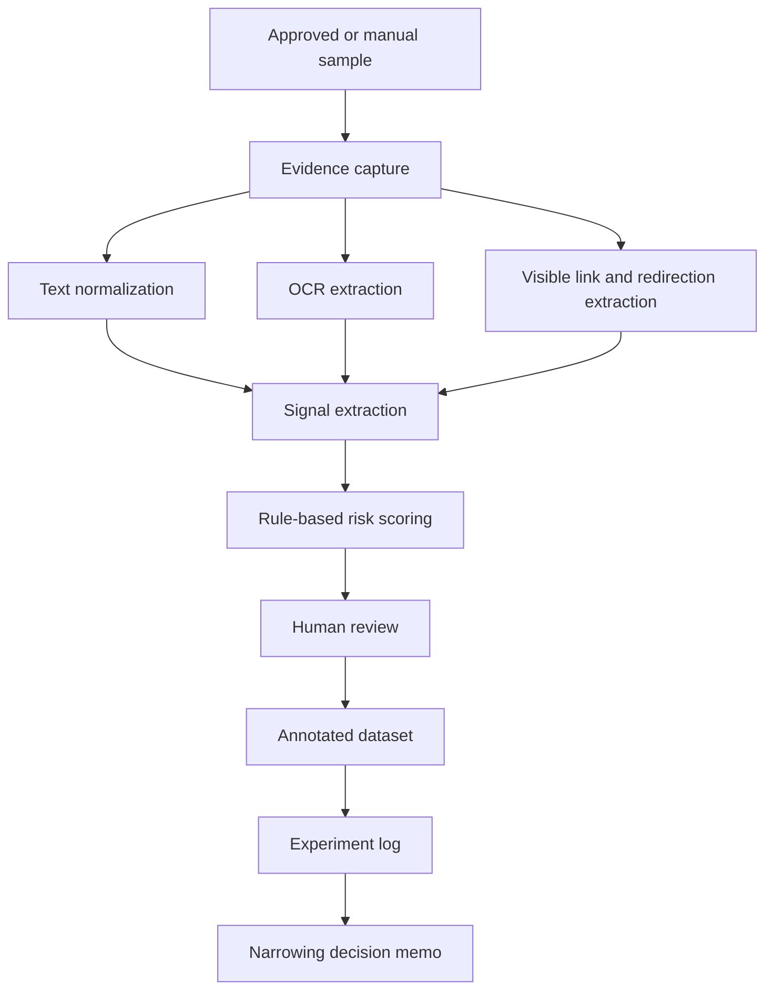
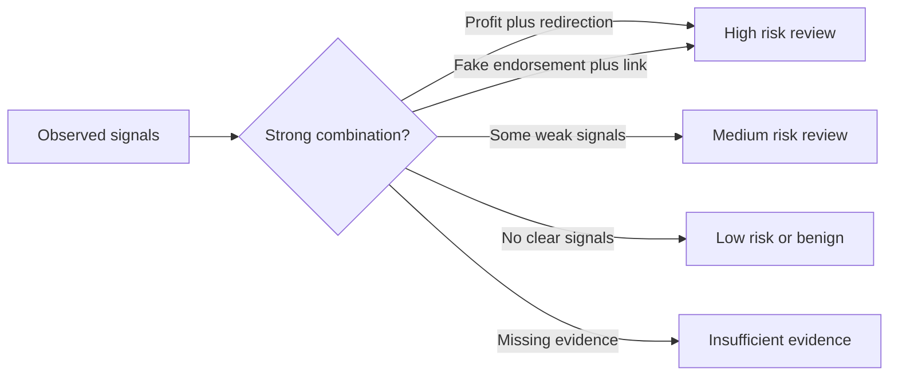
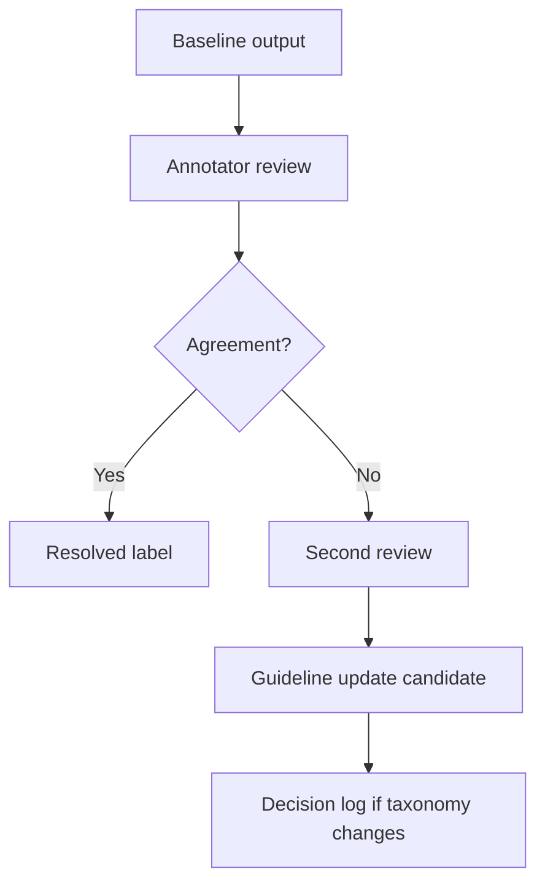

# System Concept

## Concept

The phase-1 prototype should be a research workflow, not a production system. It should capture evidence, extract low-cost signals, assign review-oriented risk tiers, and log experiments.

## High-Level Flow

## Evidence Capture

Capture only what is needed:

- Post text
- Relevant replies/comments
- Redacted image references
- OCR text
- Visible links or handles
- Collection timestamp
- Evidence snapshot status

Do not store sensitive raw material in git.

## Signal Extraction

Signals should be transparent:

- Profit or benefit promises
- Urgency
- Private-channel redirection
- Suspicious links
- Fake authority or endorsement
- Suspicious testimonials
- OCR-only claims
- Reply-only redirection

## Triage Scoring

Risk scoring should produce:

- Risk tier
- Observed signals
- Explainable reasons
- Evidence source
- Missing evidence
- Suggested review status

## Human Review Loop

## Experiment Logging

Each experiment should leave:

- Dataset version
- Schema version
- Annotation guideline version
- Method
- Cost
- Metrics
- Error analysis
- Decision implication

## What This Is Not

This is not:

- A production enforcement system.
- A fully automated detector.
- A broad Meta intelligence platform.
- A legal fraud determination engine.
- A deepfake detection system.
