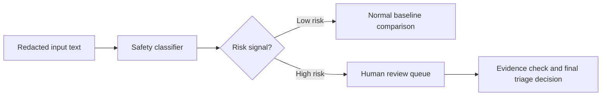
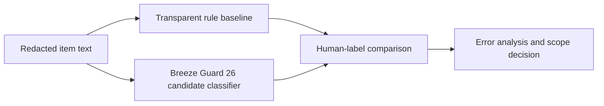

# Breeze Guard 26 Candidate Baseline Note

## Purpose

This note records Breeze Guard 26 as a Taiwan-localized safety-classifier candidate for a later Threads scam-content research baseline or guardrail test.

It does not authorize current Phase 1 model-assisted review. The active launch remains governed collection, redaction, annotation, and transparent rule-baseline comparison.

## Source Summary

Breeze Guard 26 is a MediaTek Research 8B Taiwanese Mandarin safety classifier for prompt-level harmful-content detection. The model card describes it as built on Breeze 2 8B Instruct and fine-tuned on 12,000 human-verified samples targeting Taiwan-specific safety risks.[^breeze-guard-card]

The associated TS-Bench paper presents a Taiwan Safety Benchmark with 400 human-curated prompts across Taiwan-relevant safety domains, including financial scams, medical misinformation, social discrimination, and political manipulation.[^ts-bench-paper]

## Classifier, Not A General Chatbot

Breeze Guard 26 should be understood by role as a safety classifier, not as a general-purpose assistant.

The practical distinction:

| Model role | Primary job | Typical output |
|---|---|---|
| General generative LLM | Generate answers, summaries, code, plans, or dialogue | Free-form text |
| Safety classifier or moderation model | Judge whether input text is safe or risky under a fixed policy or taxonomy | Verdict, category, or risk signal |

Technically, Breeze Guard 26 is still built from the Breeze 2 8B Instruct decoder-only LLM family. The difference is the task framing and fine-tuning target: it is used to judge harmfulness in user prompts, not to serve as an open-ended chat assistant.

Do not assume it exposes a stable JSON probability API. The public model card describes generation with judge roles and a structured safety verdict such as `<score>yes</score>` or `<score>no</score>`, with optional reasoning in thinking mode. Any future experiment must record the exact prompt, inference mode, parser, and category-mapping method used.

For this repo, the architecture should be:

This matches the repo's existing direction: AI-assisted risk triage plus human review, not autonomous scam adjudication.

## Supported Risk Categories

Use the official category names when mapping this model into project notes.

| Breeze Guard 26 category | Working meaning | Threads research relevance |
|---|---|---|
| `scam` | Scam-like content such as e-commerce scams, ATM scams, phishing, or fake customer service | Closest match to this repo's core scam-like triage label |
| `fin_malpractice` | Unlawful or improper financial advice, investment-pumping, or guaranteed-profit claims | Useful for investment lures, underground stock-tips, copy-trading, and "teacher-led" investment posts |
| `health_misinfo` | Unverified medical claims or food-safety misinformation | Relevant to health-miracle scam-like claims, but not the main phase-1 target |
| `gender_bias` | Gender stereotypes or discrimination | Mostly a safety-adjacent category, not a scam label |
| `group_hate` | Ethnic, religious, regional, or social-group hate | Mostly a safety-adjacent category, not a scam label |
| `pol_manipulation` | Political disinformation, political manipulation, or partisan attacks | Relevant only when scam-like content overlaps with political manipulation |

Do not replace this table with "obscenity" or a standalone "vulgar language" label. The official model-card taxonomy lists the six categories above.

## Fit To This Repo

The useful point is not that Breeze Guard 26 is a final detector. The useful point is that it turns Taiwan-localized safety risks into a testable label space.

Possible later uses:

- External baseline against the repo's transparent rule baseline after labels are stable.
- Taiwan-localized safety guardrail for a future LLM-assisted review workflow.
- Category-aware triage signal for `scam`, `fin_malpractice`, and `health_misinfo` cases.
- Comparative benchmark for whether the repo's Threads-specific evidence fields add value beyond prompt-level text classification.

Recommended first comparison, if later authorized:

The input should be a redacted, source-marked text bundle drawn only from approved fields such as `post_text`, `reply_texts`, and `ocr_text`. If visible links or handles are included, they should be redacted or normalized according to the active data-authorization record.

## Required Preconditions Before Any Test

Do not run Breeze Guard 26 on project evidence until all of these are true:

- Governed real evidence exists and has passed redaction review.
- Labels are stable enough for a meaningful baseline comparison.
- A later decision record explicitly authorizes model-assisted or classifier-assisted testing.
- The execution plan states whether inference is local or remote.
- Any third-party processing of controlled evidence is explicitly authorized.
- The run record captures dataset version, prompt template, model identifier, inference mode, output parser, and storage location.

If local inference is used, record hardware, precision, model revision, dependency versions, and runtime cost. If remote inference is proposed, treat it as a data-governance decision before any item-level text is sent.

## Claim Boundaries

Safe wording:

> Breeze Guard 26 may help detect text that has scam, unlawful-financial, health-misinformation, or political-manipulation characteristics in Taiwanese Mandarin.

Do not write:

> Breeze Guard 26 can precisely determine whether a Threads item is a scam.

Reason: the model sees text signals. It cannot verify real identity, bank flows, account control, company registration, investment-adviser license status, link backends, or the legal facts of a case.

Use it as a safety sentinel or baseline candidate, not as a final adjudicator.

## Known Limitations To Carry Into Evaluation

- It is optimized for Taiwanese Mandarin and may generalize less well to English, mixed-language, slang-heavy, or highly stylized content.
- It is prompt-level and text-only in the current public framing.
- It can be over-sensitive in ambiguous cases where legitimate advice resembles scam phrasing.
- Its six-category taxonomy is useful but not exhaustive.
- It may not capture new scam scripts without benchmark and dataset refresh.

These limits are compatible with the repo's existing triage stance: preserve uncertainty, surface evidence, and route high-risk cases to human review.

## Later Experiment Sketch

Only after authorization, create an experiment log under `experiments/baselines/` with:

- hypothesis: Breeze Guard 26 improves or complements Taiwan-localized scam-like triage over transparent rules
- data slice: redacted, approved, high-confidence or adjudicated items
- method: rule baseline versus Breeze Guard 26 on identical redacted text bundles
- outputs: parsed safety verdict, tested category or prompt variant, parser status, and evidence references
- metrics: precision, recall, F1, high-risk queue yield, false positives, false negatives, and reviewer burden
- failure modes: over-sensitive finance/health/political cases, missed OCR/reply context, privacy risk, prompt instability, and cost
- decision implication: keep as later auxiliary signal, revise prompt/evaluation, defer, or reject

[^breeze-guard-card]: MediaTek Research, "Breeze Guard 26" model card, Hugging Face, https://huggingface.co/MediaTek-Research/Breeze-Guard-26
[^ts-bench-paper]: Po-Chun Hsu et al., "Taiwan Safety Benchmark and Breeze Guard: Toward Trustworthy AI for Taiwanese Mandarin," arXiv:2603.07286, 2026, https://arxiv.org/html/2603.07286
