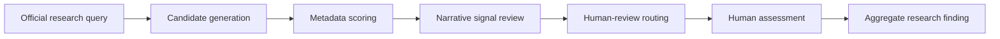
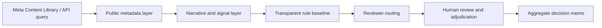

# Meta Content Library / API Access Record

## Purpose

This document records the official Meta data-access route for the CIB/165 Threads scam-content research case.

The project should use Meta Content Library / API as the primary governed research access route where it is available for the approved research question. The regular Threads API may be used only as a bounded supplementary route when the controlled launch record explicitly approves it.

This document does not authorize scraping, unofficial APIs, browser harvesting, unbounded monitoring, or production enforcement.

## Verified Official Documentation Snapshot

Verified on `2026-05-21` from Meta documentation:

- User-provided screenshot of Meta Transparency Center page `Meta Content Library and API`, marked updated `2026-04-30`, states that Meta Content Library and Content Library API provide comprehensive access to the public content archive from Facebook, Instagram, and WhatsApp Channels. The same visible page states that the web-based tool also provides access to content from Threads.[^mcl-transparency]
- In that screenshot's "Available data" section, Threads data is described as posts shared by public profiles with 100 or more followers.[^mcl-transparency]
- Meta Content Library is a controlled-access web tool for researchers to explore public content across Meta technologies.[^mcl-overview]
- Meta Content Library API supports programmatic analysis in Python and R inside Meta Secure Research Environment or an approved third-party cleanroom.[^mcl-overview]
- Access requires qualified academic or research-institution affiliation, application through Research Tools Manager, CASD review, and approval before access.[^mcl-access]
- A user-provided screenshot of Meta Research Tools Manager at `www.facebook.com/research-tools-manager` shows the application workflow: submit application, CASD application review, Meta processing, and email-based access details. The full repo-safe transcription is recorded in [../notes/2026-05-21-meta-research-tools-manager-application-flow.md](../notes/2026-05-21-meta-research-tools-manager-application-flow.md).
- A later user-provided screenshot of the Research Tools Manager application draft shows the `Personal information` page. The repo-safe field transcription and filling strategy are recorded in [../notes/2026-05-21-meta-research-tools-manager-personal-information-page.md](../notes/2026-05-21-meta-research-tools-manager-personal-information-page.md); the application ID, logged-in account identity, email, ORCID, CV details, and completed personal values are intentionally omitted from git.
- Content Library documentation lists Threads public content as posts shared by public profiles with 100 or more followers.[^mcl-content]
- Threads content is noted as not available for download while that dataset is in development.[^mcl-content]
- The Content Library API documentation describes near real-time public discussion data from Facebook and Instagram, with dedicated endpoints, more than 100 data fields, up to 100,000 results per query, and asynchronous search.[^mcl-api]
- The regular Threads API is a developer API for Threads integrations, publishing, profile/content access, replies, insights, webhooks, oEmbed, web intents, and keyword or hashtag search.[^threads-api]
- Threads keyword search requires `threads_basic` and `threads_keyword_search`; without `threads_keyword_search`, search is limited to posts owned by the authenticated user. Approved keyword search can search public posts, but is query-limited and may return empty results for keywords Meta treats as sensitive or offensive.[^threads-keyword]

## Route Comparison

| Route | Role | Use in this project | Do not assume |
|---|---|---|---|
| Meta Content Library UI | Controlled-access research interface for public content discovery, search, filtering, trends, producer lists, and item review | Primary discovery and query-design route for approved public Threads research where Threads data is surfaced | That Threads records can be downloaded or exported while the Threads dataset is still marked in development |
| Meta Content Library API | Research API for programmatic analysis inside a secure cleanroom | Primary programmatic route when the approved cleanroom exposes the needed surface, fields, and query behavior | That API coverage exactly matches UI coverage for Threads without checking the approved environment |
| Official Threads API | Developer API for account integrations and bounded public keyword/hashtag search | Supplementary route for tightly scoped keyword search or own-account/reply/insight workflows only if approved | Full-platform monitoring, arbitrary user graph collection, full history, private data, or unrestricted public scraping |
| Unofficial scraping or third-party Threads APIs | Non-official collection path | Not part of this repo's approved path | Legal/platform stability, defensibility, or safe handling of investigative evidence |

## Research-Scale Interpretation

Meta Content Library / API should be treated as official research-scale infrastructure, not as a normal app developer API.

For this repo, the useful contrast is:

| System | Nature | Project reading |
|---|---|---|
| Threads API | Developer API for app integrations, publishing, account workflows, and scoped search | Useful only as a bounded supplementary route |
| Meta Content Library / API | Controlled research access platform for public-interest and scientific study of public content | Preferred official route for approved Threads scam-content research |

The research value is not unrestricted collection. The research value is the ability to conduct governed public-discourse analysis through official access controls.

Relevant capability classes for this project include keyword search, trends, producer lists, approved API access, and large query workflows where the approved environment supports them. The Content Library API documentation has been recorded as describing API-scale features such as asynchronous search, more than 100 data fields, and up to 100,000 results per query for supported API surfaces.

Do not generalize those capabilities beyond the approved surface:

- Threads content availability must be checked in the approved environment.
- UI, API, and download/export coverage can differ.
- Threads download/export must not be assumed while official documentation marks that dataset as in development.
- Missing official coverage is a research limitation, not permission to scrape.

The full conceptual note is [../notes/2026-05-21-meta-content-library-research-scale-platform.md](../notes/2026-05-21-meta-content-library-research-scale-platform.md).

## Scam-Research Fit

Meta Content Library / API is well aligned with this CIB/165 Threads research case because the project is about candidate generation, triage, and reviewer routing, not final fraud determination.

Potential official-route research tasks:

- keyword diffusion analysis for investment-scam language
- trend analysis for sudden narrative spikes
- producer-list review for bounded high-risk candidate sets
- clustering or deduplication of repeated public claims
- reviewer-priority scoring based on metadata and narrative signals

Example keyword families for Taiwan investment-scam research may include terms such as `穩賺`, `帶你操作`, `老師帶單`, `USDT`, `免費教學`, and `被動收入`. Exact query strings, raw results, handles, URLs, and screenshots belong in controlled run records outside git unless explicitly redacted and approved.

Use safer naming:

- `candidate_generation`, not confirmed scam detection
- `suspect_candidate_producer_list`, not scammer list
- `review_priority_score`, not guilt score
- `narrative_spike`, not criminal campaign proof

The mature workflow is:

## CIB Project Rule

For the CIB/165 Threads scam-content research case:

1. Default to Meta Content Library / API as the official research-grade access route.
2. Use the regular Threads API only when the controlled launch record names the endpoint, permission, fields, date range, query count, and retention rule.
3. Do not use scraping, browser automation, unofficial APIs, or bulk export unless a later decision explicitly approves the exact run and explains why official routes cannot answer the research question.
4. Treat any mismatch between Content Library UI, Content Library API, and Threads API as a research limitation, not as permission to work around controls.
5. Store raw query outputs, credentials, cleanroom exports, screenshots, URLs, handles, and item-level sensitive artifacts outside git.

## Research Tools Manager Application Flow

The visible Research Tools Manager application page describes a four-step process:

| Step | Visible process | Planning implication |
|---|---|---|
| 1. Submit application | Lead researcher submits the research program, organization, and collaborators after reviewing the application guide and product documentation. The application can take more than 30 minutes and can be saved across sessions. | Prepare the research program description, organization information, collaborator list, and data-minimization plan before starting. |
| 2. Application review | CASD independently reviews eligibility for Meta Content Library access. This can take 2 to 3 weeks, with status tracked in Research Tools Manager. | Treat CASD review as a schedule dependency and record only repo-safe status in git. |
| 3. Application in process | Meta processing typically takes 2 to 3 weeks after application review. | Do not assume access immediately after review; keep pilot timing flexible. |
| 4. Gain access | The applicant receives an email with access details. | Keep access emails, invitation links, credentials, and environment details outside git. |

The repo-safe screenshot note is [../notes/2026-05-21-meta-research-tools-manager-application-flow.md](../notes/2026-05-21-meta-research-tools-manager-application-flow.md). Do not commit screenshots or logged-in account identity details unless a later governance decision explicitly approves a redacted artifact.

## Application Framing

The Research Tools Manager application should be written for a research-governance review audience, not a developer API audience.

Avoid this framing:

> We want to catch scam accounts.

Use this framing:

> Study public investment-scam narratives and metadata-based reviewer-support mechanisms under large-scale social media environments.

Recommended research question:

> How can metadata-based reviewer-assist systems reduce human review burden while preserving uncertainty awareness and minimizing over-enforcement risks in large-scale public social-media scam monitoring?

The application should emphasize:

- institutional and academic accountability
- public-interest online-harm research
- metadata-first observational method
- no private messages or private account data
- no de-anonymization goal
- no autonomous accusation or enforcement
- human review as the final review step
- aggregate and redacted outputs by default
- controlled raw storage outside git
- IRB, privacy, safety, and retention review

Use [../templates/meta_research_tools_application_prep.md](../templates/meta_research_tools_application_prep.md) before clicking `Get started`.

The first-principle application strategy is [53-first-principle-meta-research-tools-application-strategy.md](53-first-principle-meta-research-tools-application-strategy.md). Its core rule is that the scarce resource is trust, not data volume or model power.

## Required Run Record

Every Meta Content Library / API or Threads API run must record, outside git if sensitive:

- operator and role ID
- official route: `meta_content_library_ui`, `meta_content_library_api`, or `threads_api_keyword_search`
- access environment: Research Tools Manager, Secure Research Environment, approved cleanroom, or Threads developer app
- approval reference and controlled launch record ID
- endpoint, UI search, API search ID, or query identifier
- keywords, hashtags, producer lists, date range, language, media type, and filters
- requested fields and field-minimization rationale
- query count, returned count, retained count, excluded count, and exclusion reasons
- raw output path outside git
- redacted annotation output path
- whether Threads content was accessible through UI, API, both, or neither
- whether any download/export was used and why it was approved
- stop-condition review

Repo-visible notes may include only aggregate counts, non-sensitive query classes, route names, and limitations.

## Field Mapping For This Repo

For v1 `thread_item` records, keep `source_type` as `api_authorized` for approved Meta API-derived records. Record the exact route (`meta_content_library_ui`, `meta_content_library_api`, or `threads_api_keyword_search`) in the outside-git run record and, if safe, in `metadata_notes`.

| Official data element | Repo field or handling |
|---|---|
| post text or media text | `post_text` or `ocr_text`, after redaction review |
| timestamp | `collection_timestamp` for collection time; platform timestamp can be noted in `metadata_notes` if needed and approved |
| media type | `metadata_notes`, `has_image`, `image_count`, `screenshot_style` |
| permalink or source URL | `source_url_if_stored` only if approved; otherwise redacted source reference |
| username or profile identifier | usually redacted; store only category or pseudonymous source reference unless approved |
| public replies/comments | `reply_texts` only when selected, relevant, public, and approved |
| visible links or domains | `external_links`, preferably normalized or redacted |
| engagement metrics, view counts, comment counts | aggregate analysis or `metadata_notes`; do not expand schema until a pilot decision shows the field is necessary |
| query metadata | run record outside git; aggregate summary only in repo |

The schema should remain evidence-minimal until the first pilot proves which metadata fields materially improve triage.

## Research Architecture

The right target is not "the strongest classifier." The target is governed triage under scarce review capacity.

Layer A: public metadata and provenance.

- timestamp
- keyword, hashtag, media type, language, and date filters
- public profile eligibility when surfaced by the official tool
- visible link/domain category
- duplicate or near-duplicate structure
- posting burst or trend only when supported by official outputs

Layer B: narrative signals.

- guaranteed profit
- urgency
- fake authority
- private-channel redirect
- crypto or investment funnel
- suspicious testimonial
- health-miracle or financial-malpractice language

Layer C: human review.

- queue high-risk cases
- preserve uncertainty
- record missing evidence
- avoid legal or fraud determinations
- measure reviewer burden and false-positive risk

## Stop Conditions

Pause the run if:

- the official environment does not expose the expected Threads field or endpoint
- a query needs sensitive or offensive terms that the API blocks or handles unexpectedly
- a query returns more records than the approved run limit
- the operator needs unapproved profile history, user graph, or private data
- download/export is unavailable or not approved
- raw outputs cannot be stored outside git
- redaction rules for usernames, permalinks, images, OCR, or handles are unclear
- output fields exceed the approved field list

## Claim Boundary

Allowed:

- "Using the approved official Meta research access route, the pilot collected a bounded diagnostic slice."
- "Content Library / API results were used for research triage and evidence design."
- "Threads API keyword search was used only as a scoped supplementary source, if approved."

Not allowed:

- "The dataset represents all Threads scam content."
- "The API provides unrestricted full-platform monitoring."
- "The system determines that a user committed fraud."
- "Blocked, missing, or non-downloadable official data can be replaced by unofficial scraping."

[^mcl-overview]: Meta for Developers, "Meta Content Library and API", https://developers.facebook.com/docs/content-library-and-api/
[^mcl-transparency]: Meta Transparency Center, "Meta Content Library and API", https://transparency.meta.com/researchtools/meta-content-library/
[^mcl-access]: Meta for Developers, "Get access - Meta Content Library and API", https://developers.facebook.com/docs/content-library-and-api/get-access
[^mcl-content]: Meta for Developers, "Content Library - Meta Content Library and API", https://developers.facebook.com/docs/content-library-and-api/content-library
[^mcl-api]: Meta for Developers, "Content Library API - Meta Content Library and API", https://developers.facebook.com/docs/content-library-and-api/content-library-api
[^threads-api]: Meta for Developers, "Threads API", https://developers.facebook.com/docs/threads/
[^threads-keyword]: Meta for Developers, "Keyword Search - Threads API", https://developers.facebook.com/docs/threads/keyword-search/
