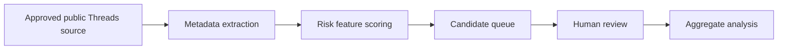

# First-Principle Meta Research Tools Application Strategy

## Purpose

This document records the first-principle strategy for applying to Meta Research Tools Manager for Meta Content Library / API access.

The application should not be framed as an app build, a scraper replacement, a policing system, or a production detector. It should be framed as a public-interest research request for governed access to official research infrastructure.

## Scarce Resource

The scarce resource is not model power or data volume.

The scarce resource is trust:

- trust from Meta and CASD that the research team will not misuse controlled access
- trust from CIB/165 stakeholders that the research preserves evidence boundaries
- trust from reviewers that the system supports human judgement rather than replacing it
- trust from future readers that the repo preserves uncertainty and avoids overclaiming

Therefore, the application must lead with governance, ethics, minimization, and reviewer support before discussing detection performance.

## First-Principle Chain

1. Public social-media scam-like content is ambiguous evidence, not proof of legal fraud.
2. Full-platform collection is not necessary to answer the first research question.
3. Unofficial scraping creates legal, platform, privacy, reproducibility, and stakeholder-trust risk.
4. The regular Threads API is primarily a developer/app route, not a complete research archive.
5. Meta Content Library / API is the official controlled research route where access and surface coverage are approved.
6. Therefore, the right request is not "give us data to catch scammers."
7. The right request is "allow bounded official access so we can study public investment-scam narratives and metadata-based reviewer-support mechanisms."
8. The output should be candidate generation, risk-priority reasoning, and aggregate research findings.
9. The final judgement remains human, and legal/platform enforcement remains outside this repo.

## Recommended Research Question

Use this as the application north star:

> How can metadata-based reviewer-assist systems reduce human review burden while preserving uncertainty awareness and minimizing over-enforcement risks in large-scale public social-media scam monitoring?

A shorter application-facing version:

> Study public investment-scam narratives and metadata-based reviewer-support mechanisms under large-scale social media environments.

## Application Positioning

Lead with:

- public-interest online-harm research
- academic and institutional accountability
- public Threads content only
- data minimization
- metadata-first observation
- human review as the final judgement step
- no autonomous accusation
- no legal fraud determination
- no private messages or private accounts
- controlled raw storage outside git
- aggregate and redacted outputs by default
- clear retention, deletion, and access rules

Do not lead with:

- "catch scam accounts"
- "build a scam classifier"
- "monitor all Threads"
- "automate enforcement"
- "scrape public pages if API access is incomplete"
- "publish account-level examples"

## Minimal Viable Research Architecture

This architecture keeps the research question operational:

- candidate generation is not accusation
- scoring is prioritization, not verdict
- reviewer routing is the value proposition
- aggregate analysis is the publishable output

## What To Prepare Before Submission

Prepare these before clicking `Get started` in Research Tools Manager:

| Item | Needed content |
|---|---|
| Research purpose | Public-interest study of scam-like public investment narratives and reviewer-support mechanisms. |
| Research question | The metadata-based reviewer-assist question above, or a narrower approved variant. |
| Institutional context | Academic affiliation, lead researcher role, collaborator roles, and accountable organization. |
| Data minimization | Field list, why each field is necessary, and why excluded fields are not needed. |
| Governance boundary | Public data only, no private messages, no autonomous accusation, aggregate reporting. |
| Ethics / IRB position | Whether the work is human-subjects research, needs review, or is exempt/observational. |
| Storage / access / retention | Controlled raw storage, access roles, deletion schedule, and repo-safe outputs. |
| Misuse prevention | No scraping fallback, no account naming, no enforcement claims, no raw evidence in git. |
| Output plan | Aggregate metrics, reviewer-burden analysis, redacted examples only if approved. |

Use `templates/meta_research_tools_application_prep.md` to draft the application materials outside git if sensitive.

## Personal Information Page Strategy

The personal-information page should establish accountable research identity,
not describe the project.

Visible fields and fill guidance are recorded in
[../notes/2026-05-21-meta-research-tools-manager-personal-information-page.md](../notes/2026-05-21-meta-research-tools-manager-personal-information-page.md).
Use exact legal and institutional information in the actual application, while
keeping legal name, organizational email, ORCID, CV file names, uploaded CVs,
application IDs, and access screenshots out of git.

Recommended stance:

- use the applicant's exact legal name from official records;
- use institutional country, state/province, and city consistent with the next
  organization section;
- use an institutional email, not a personal mailbox;
- choose the closest academic discipline category rather than a marketing term;
- upload a concise academic CV if ready, because it strengthens trust and
  eligibility;
- keep CIB-sensitive details, raw evidence, screenshots, handles, URLs, and
  access identifiers out of the CV and repo.

## Claim Boundary

Allowed:

- "The project studies public investment-scam narratives under official research access."
- "The system generates suspicious candidates for human review."
- "The evaluation measures reviewer burden, uncertainty handling, and false-positive pressure."
- "The output is aggregate research evidence and repo-safe decision support."

Not allowed:

- "The system identifies criminals."
- "The dataset captures all Threads scam content."
- "The model determines fraud."
- "API gaps can be bypassed by scraping."
- "Producer lists are scammer lists."

## Relationship To Breeze Guard 26

Breeze Guard 26 may become a later classifier comparison or guardrail candidate, but it should not be used to justify the Research Tools Manager application.

The access request should stand on the research question and governance plan, not on the availability of any single model.

If Breeze Guard 26 is later tested, it should be evaluated as an auxiliary safety-classifier signal for human-review routing on approved redacted text, not as final adjudication.

## Relationship To Versioning

This document is part of the `v1.3.0` repo operating update. It formalizes the shift from generic "API access" language to first-principle Research Tools Manager application strategy.
