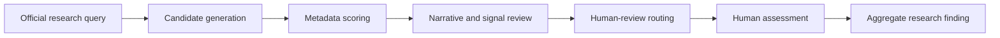

# Meta Content Library / API As Research-Scale Social Data Infrastructure

- Date recorded: 2026-05-21
- Source: user-provided notes and previously recorded official Meta Content Library / API documentation links
- Primary public reference: https://transparency.meta.com/researchtools/meta-content-library/
- Repo-safe note: this file records conceptual planning value and research workflow implications. It does not authorize collection, scraping, download, export, or API use.

## Core Interpretation

Meta Content Library / API is best understood as Meta's official research-grade social data access platform for qualified researchers.

It is materially different from the regular Threads API:

| System | Primary nature | Practical reading for this repo |
|---|---|---|
| Threads API | Developer API for app integrations, publishing, account workflows, replies, insights, and scoped search permissions | Useful as a bounded supplementary API route, not a full research archive |
| Meta Content Library / API | Controlled research access platform for public-interest and scientific study of public content across Meta surfaces | Preferred official route for Threads scam-content research when access and surface coverage are approved |

The project should treat Meta Content Library / API as research-scale infrastructure, not as a normal social-media management API.

## Threads Coverage

The documented Threads coverage is important because it confirms that Threads can be part of the research surface.

The visible documentation and prior repo record state that Threads data includes posts shared by public profiles with 100 or more followers.

This means the platform can support research on public Threads posts, but it does not imply complete platform coverage.

Key limitations:

- only public profile content is in scope
- the visible threshold is 100 or more followers
- private accounts, private messages, private groups, and non-public surfaces are not in scope
- UI availability, API availability, and export/download availability must be checked separately in the approved environment
- missing or unavailable official coverage is a research limitation, not permission to scrape

## Why It Fits Scam Research

The platform is relevant to Threads scam research because it supports research workflows that are difficult or inappropriate to run through the regular Threads API alone.

Relevant capability classes:

- keyword search
- trend analysis
- producer lists
- large result sets where officially supported
- API access in approved secure environments
- query-based public-discourse research
- comparative study of narrative spread, repeated claims, and campaign-like behavior

The Content Library API documentation has been recorded in this repo as describing API-scale features such as dedicated endpoints, asynchronous search, more than 100 data fields, and up to 100,000 results per query for supported API surfaces.

Important boundary:

- Do not assume that every Content Library API feature applies identically to Threads.
- Do not assume Threads download/export is available unless the approved environment confirms it.
- Record per-run whether Threads was available through the web UI, API, both, or neither.

## Example Research Use Cases

### A. Keyword Diffusion Analysis

Candidate keyword families for Taiwan investment-scam research may include:

- "穩賺"
- "帶你操作"
- "老師帶單"
- "USDT"
- "免費教學"
- "被動收入"

Research questions:

- Which public posts match the query family?
- Which terms, hashtags, or phrases co-occur?
- Which narratives increase suddenly over time?
- Which public producers or producer groups repeatedly appear?
- Which queries produce too many false positives for human review?

Repo boundary:

- Query strings may be recorded in controlled run records.
- Sensitive exact query runs, raw results, URLs, handles, and screenshots stay outside git unless explicitly redacted and approved.
- Repo-visible notes should summarize query families and aggregate counts only.

### B. Producer Lists

Producer lists are relevant because they allow researchers to focus a search query on public posts from specific post owners where the official tool supports that workflow.

Potential research uses:

- track a high-risk public producer list after approval
- compare suspect-candidate producers against benign comparison producers
- test whether repeated investment funnel language appears across a bounded group
- evaluate whether producer-list monitoring helps reviewer prioritization

Boundary:

- Do not call the list a confirmed scammer list.
- Use terms such as `suspect_candidate_producer_list`, `high_risk_candidate_list`, or `review_priority_list`.
- Keep producer identifiers, handles, and exact list membership outside git unless explicitly approved and redacted.

### C. Trends

Trend graphs showing how often matching posts were shared can support:

- campaign-like spike detection
- narrative propagation analysis
- seasonal or event-linked scam-message monitoring
- query-family calibration
- reviewer workload planning

Boundary:

- Trend evidence is signal evidence, not proof of coordinated criminal conduct.
- A spike can indicate public attention, news cycles, benign discourse, or spam-like behavior; human review is still required.

## Access And Eligibility

Meta Content Library / API is not open to everyone.

The access path is application-based and review-based. Prior repo notes record that access requires qualified academic or research-institution affiliation, application through Research Tools Manager, CASD review, and approval.

The project should frame its application around:

- scientific or public-interest research purpose
- public Threads scam-content research
- metadata-first and governance-aware methodology
- reviewer-scarcity and human-review routing
- privacy-preserving data minimization
- bounded pilot scale
- no legal guilt determination
- no production enforcement claim

This project is a stronger fit when described as public-interest cybercrime triage research rather than platform-wide fraud detection.

## Recommended Research Framing

Do not frame the work as:

> Find all scam posts on Threads.

That framing creates legal, platform, and false-positive risk.

Frame it as:

> Generate and prioritize suspicious candidates for human review under governed, bounded, official research access.

The mature workflow is:

## Stage Model

### Stage 1: Candidate Generation

Use approved search, trend, keyword, hashtag, or producer-list workflows to generate candidate posts or clusters.

Output:

- suspicious candidates
- query-family summaries
- aggregate result counts
- candidate clusters

Do not output:

- confirmed scam labels
- criminal determinations
- enforcement targets

### Stage 2: Metadata Scoring

Possible scoring signals:

- posting burst
- repeated call to action
- visible external domains
- emoji density
- suspicious linguistic patterns
- repeated private-channel redirection
- public producer-list overlap
- account or content coordination indicators, only when supported by official fields

Scoring should preserve uncertainty and should produce reasons, not verdicts.

### Stage 3: Human-Review Routing

The system should prioritize review rather than replace review.

Output:

- high-priority review queue
- reasons for priority
- uncertainty score or missing-evidence flag
- safe aggregate metrics

Final judgement remains with authorized human review and, where relevant, legal or platform processes outside this research repo.

## Strategic Significance

The existence of Meta Content Library / API suggests that Meta recognizes a need for controlled research transparency infrastructure for public social-platform harms, including misinformation, scams, elections, coordinated influence, and AI spam.

For this repo, the strategic takeaway is:

- use official access infrastructure
- keep the research question bounded
- build a defensible evidence trail
- preserve uncertainty
- measure reviewer efficiency and false-positive risk
- avoid claims of total platform coverage or final fraud determination

This is closer to a Trust & Safety research workflow than to a standalone classifier project.
